# RA5-512K
A remake of the RA5-512K expansion memory for the Amiga 500 made in diptrace

This is a replica of the original RA5-512K expansion memory for the A500. Two small changes/improvements has been made to this pcb.

* Increased the pitch for the battery pins to 20 mm to accomodate for a coin cell battery holder (e.g. CR2032). Moved C2 somewhat to the right.
* Added pads for Y1 to be able to use either a surface mount MC-306 crystal or a cylinder shaped one. A crystal is needed when using an old OKI M6242B RTC chip.

<a href="images/RA5-512k_pic2.jpg">
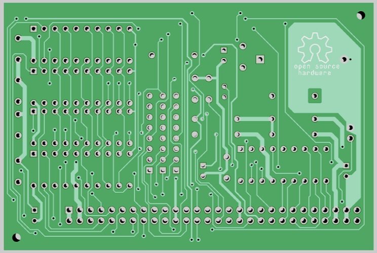
</a>

Why making this replica?

* To save/reuse components from a battery damaged/corroded A501 pcb with four (256k x 4 bit) dram chips and an OKI M6242B RTC and transplant them into a new pcb.
* Preserving a bit of history.
* For testing out diptrace.

Sending off gerbers to the Aisler boardhouse and received three good looking boards.
* https://aisler.net/p/OHZYVCCU

***

<a href="images/RA5-512k_pic3.jpg">
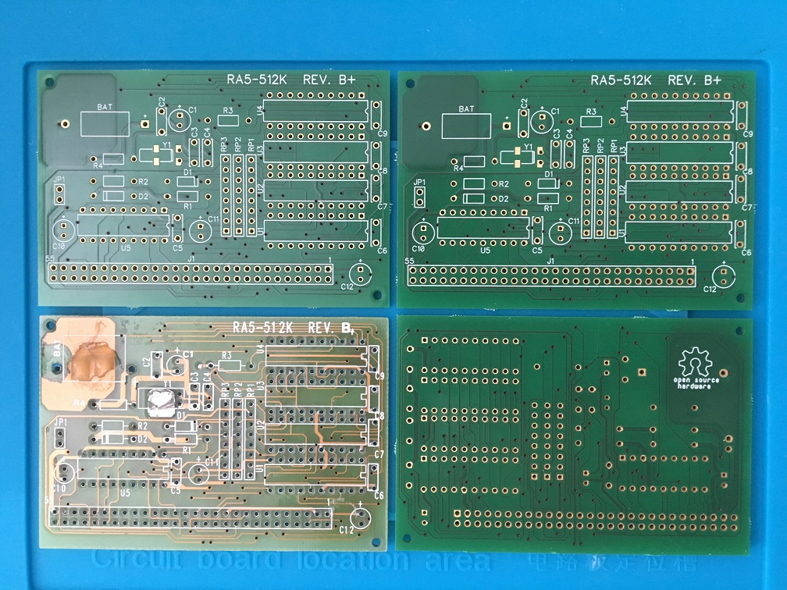
</a>

This is how the end result looks like after popualting this board:

<a href="images/RA5-512k_pic4.jpg">
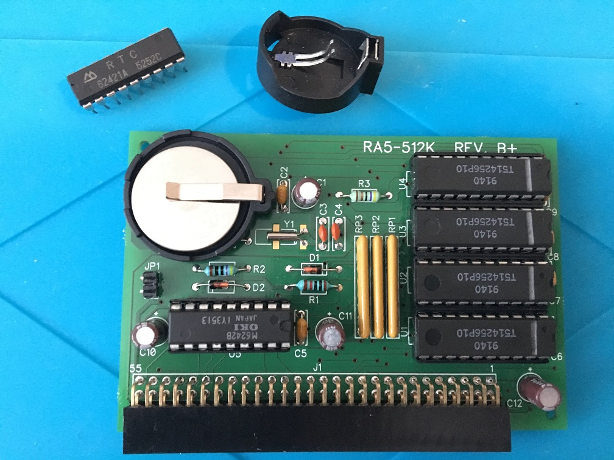
</a>

***
TODO: Insert BOM here
***

This is how the original battery damaged/corroded board looked like. The NiCd battery had leaked and the Cadmium has eaten a large chunk of the copper. I desolder all the components to reveal all the traces for reverse engineering to take place.

<a href="images/RA5-512k_pic5.jpg">
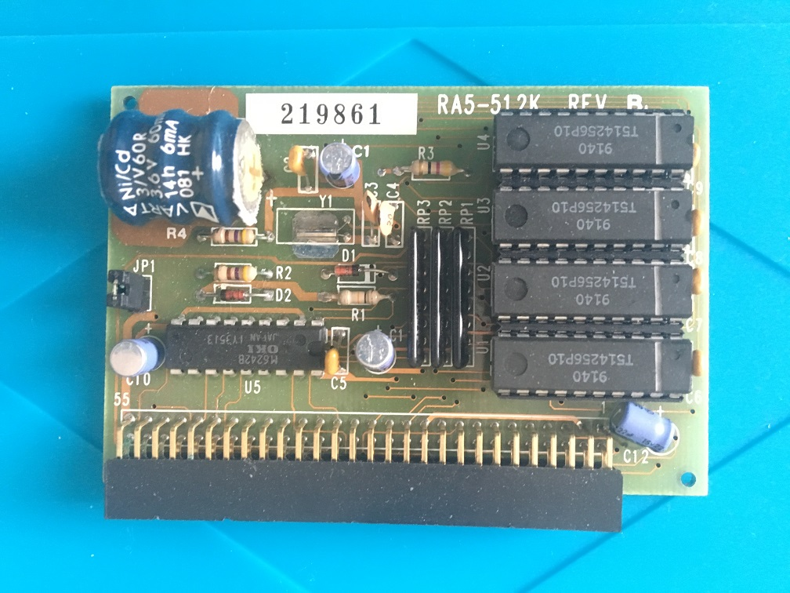
</a>
<a href="images/RA5-512k_pic6.jpg">
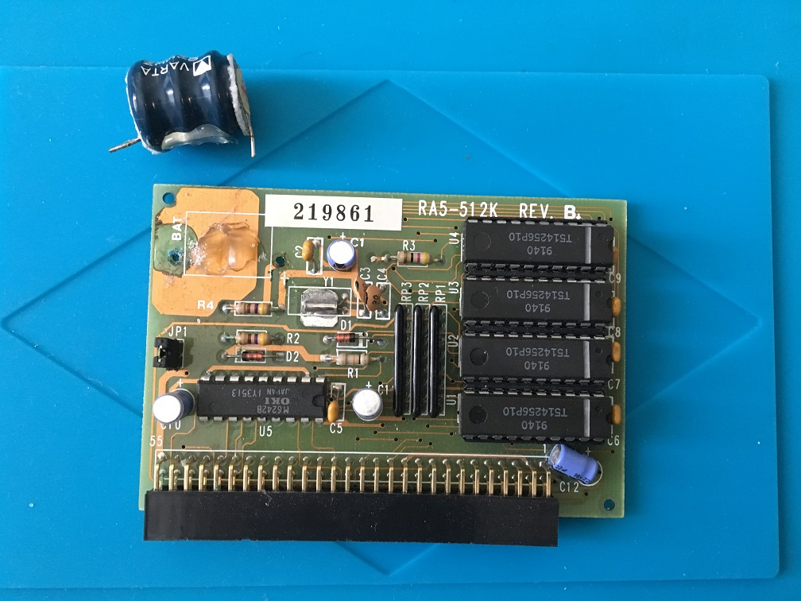
</a>
<a href="images/RA5-512k_pic7.jpg">
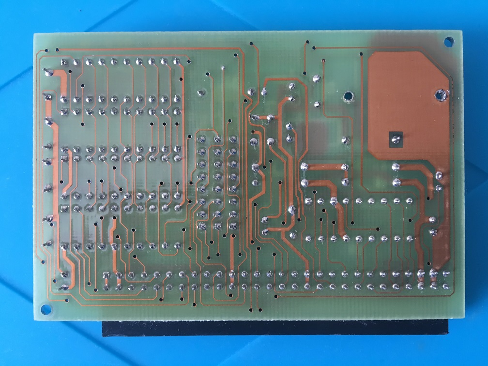
</a>
<a href="images/RA5-512k_pic8.jpg">
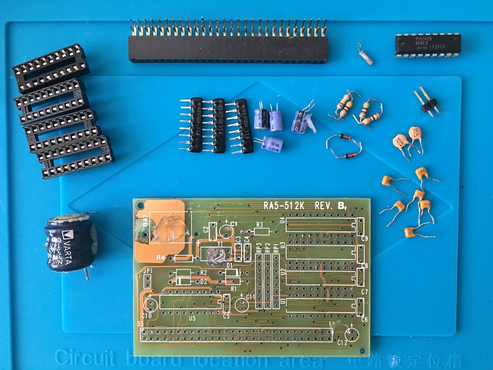
</a>
<a href="images/RA5-512k_pic9.jpg">
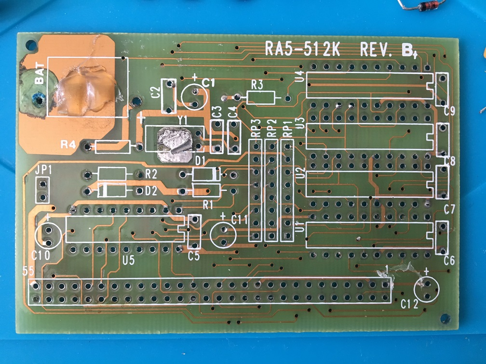
</a>
<a href="images/RA5-512k_pic10.jpg">
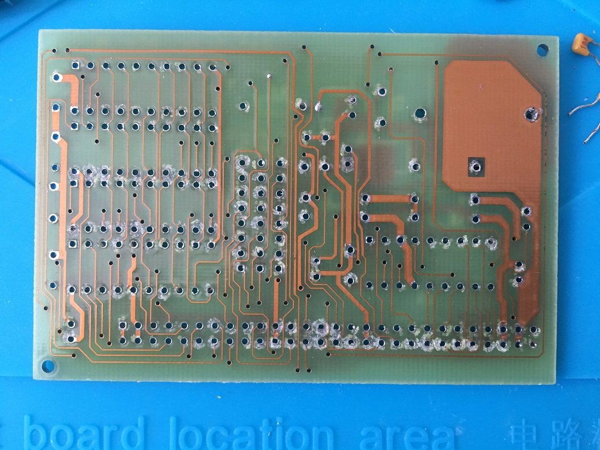
</a>
<a href="images/RA5-512k_pic11.jpg">
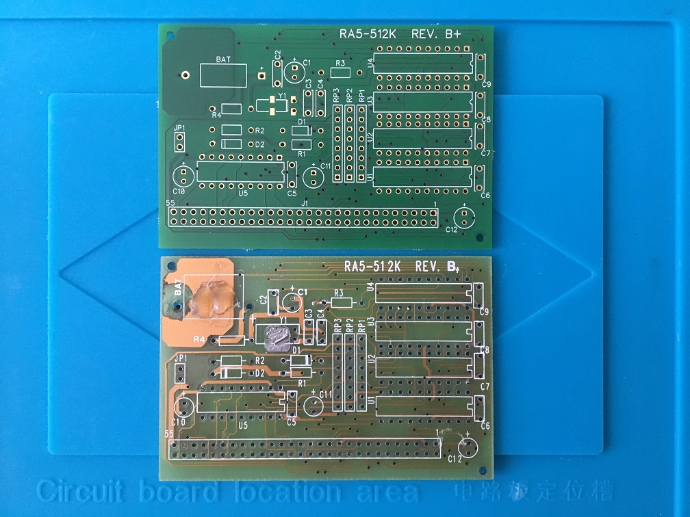
</a>
<a href="images/RA5-512k_pic12.jpg">
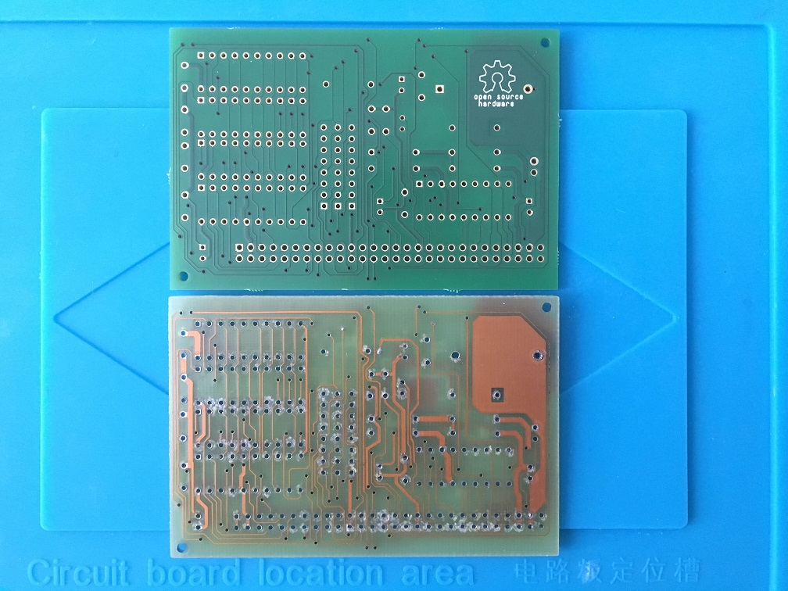
</a>
