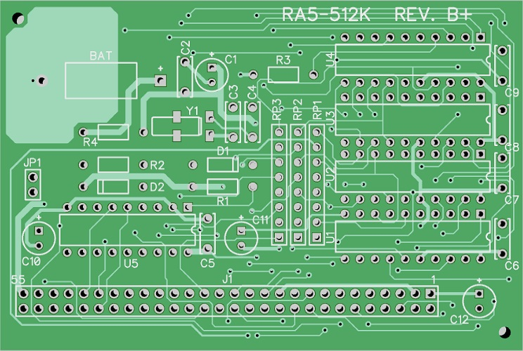

# RA5-512K
A remake of the RA5-512K expansion memory for the Amiga 500 made in diptrace

This is a replica of the original RA5-512K expansion memory for the A500. Two small changes/improvements has been made to this pcb.

1. Increased the pitch for the battery pins to 20 mm to accomodate for a coin cell battery holder (e.g. CR2032). Moved C2 somewhat to the right.
2. Added pads for Y1 to be able to use either a surface mount MC-306 crystal or a cylinder shaped one for the RTC. A crystal is needed when using an old OKI M6242B RTC chip.

Why making this replica?

-To save/reuse components from a battery damaged/corroded A501 pcb with four (256k x 4 bit) dram chips and an OKI M6242B RTC and transplant them into a new pcb.
-Preserving a bit of history.
-For testing out diptrace.

 

